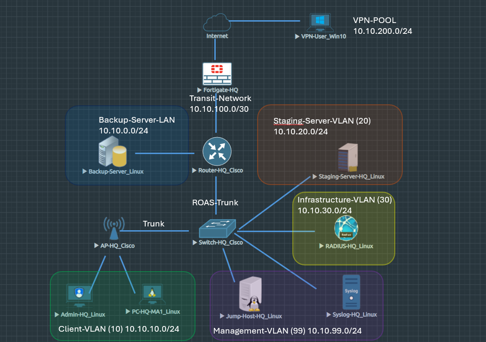

# HeptaNetworks - EVE-NG Company Network

A strictly segmented company network spanning Cisco IOS, FortiOS, Windows, and Linux, from jump-host access control to RADIUS-authenticated VPN and automated backup pipelines.





## Highlights

- Single jump host lets the admin reach every device, VPN clients included, via SSH
- VLAN segmentation enforced via per-interface ACLs
- FortiGate perimeter — IPsec/IKEv2 VPN, split-tunnel, RADIUS-authenticated
- Automated backup jobs via rsync
- Hardened management plane through SSH key authentication


## Contents

- [Architecture Decisions](#architecture-decisions)
- [Network Segmentation](#network-segmentation)
- [Notable Troubleshooting](#notable-troubleshooting)
- [Lessons Learned](#lessons-learned)
- [Things that might be implemented in the Future](#things-that-might-be-implemented-in-the-future)
- [Repository Structure](#repository-structure)


## Architecture Decisions

### Centralized administration

All network devices are managed through a dedicated jump host. This reduces
the number of systems that need direct administrative access.

### VLAN segmentation

Users, servers, infrastructure, and management systems are separated into
different network segments, with access between them controlled entirely
by router ACLs. The FortiGate firewall adds a second layer at the network
edge, managing what reaches the internet and what VPN clients can access
internally.

### Backup Server Protection

The backup server sits on its own isolated segment with no VLAN trunk, and
only ever initiates connections outward to pull data from the staging
server. The only inbound access it accepts is administrative SSH from the
jump host so that a compromised staging server has no way to reach it.

### VPN design

Remote users connect through an IKEv2 road-warrior VPN. Authentication is
handled through RADIUS, while split tunneling reduces the traffic sent through
the company network.

### Centralized logging

All the network devices and servers forward logs to a dedicated syslog-
server. This provides a single point to review activity and detect denied
traffic across the network.


## Network Segmentation

| VLAN                     | Subnet          | Gateway     | Purpose                                                        |
|--------------------------|-----------------|-------------|-----------------------------------------------------------------|
| 10 — Employees           | 10.10.10.0/24   | 10.10.10.1  | Client network, DHCP                                             |
| 20 — Staging Server      | 10.10.20.0/24   | 10.10.20.1  | Staging server (static .10)                                      |
| 30 — Infrastructure      | 10.10.30.0/24   | 10.10.30.1  | RADIUS server (.5)                                               |
| 99 — Management          | 10.10.99.0/24   | 10.10.99.1  | Jump host (.9), Syslog server (.6), Switch SVI (.12), AP SVI (.11) |
| Server LAN (no VLAN)     | 10.10.0.0/24    | 10.10.0.1   | Backup server (.5), physically isolated                          |
| Router<->Firewall transit| 10.10.100.0/30*  | —           | Router .2, FortiGate .1                                          |
| VPN pool | 10.10.200.0/24 | — (routed via FortiGate tunnel interface) | IKEv2 road-warrior clients (.10–.50) |

*I decided to use a classic /30 subnet for the Transit-Network although it could have been a /31 subnet as well.
Changing it manually would require to change the NTP-server adress at almost every other node. Possible subject for automation.

## Notable Troubleshooting

A few of the more interesting problems solved along the way:

- **Router interfaces don't come up automatically after loading a saved config:**  
  IOS initializes interfaces as administratively down by default, and an
  exported config only carries **`no shutdown`** if it was manually entered, otherwise a wiped and reloaded router comes back with every
  interface down, even though nothing looks wrong in the config itself.
  Fixed by explicitly adding **`no shutdown`** to every interface expected to
  be active on boot.

- **SSH key authentication silently failed:**
  **`PubkeyAuthentication`** was commented out in the server's SSH daemon
  config by default, so the server never considered the correctly offered
  key at all and fell back to a password prompt every time. Found by
  starting the SSH daemon in foreground debug mode and reading through the
  negotiation instead of guessing at the client side. Uncommenting the line
  and restarting the daemon fixed it immediately.

- **The Windows VPN client fought virtualization at every step:**  
  A Windows 11-Tiny image wouldn't install even with TPM/Secure-Boot checks
  bypassed, then blue-screened with CPU-compatibility errors once it did
  boot — isolated by removing QEMU CPU flags one at a time. Switched to a
  lighter Windows 10 image instead, and disk-driver detection only worked
  after renaming the virtual disk to follow EVE-NG's IDE naming convention
  instead of the VirtIO bus it defaulted to.

- **A platform limitation forced a segment redesign:**  
  The switch and access point couldn't reach the syslog server once it was
  placed on its own dedicated VLAN. Both devices route management traffic
  through a single default gateway with no further routing beyond that.
  Rather than fight the limitation, the syslog server was moved into the
  same Layer-2 segment as the switch and AP instead, sidestepping the need
  for routing entirely.

- **FortiGate's built-in RADIUS proxy was silently broken:**  
  Local-user EAP logins hung indefinitely with no error message. Digging
  into the firewall's internal debug logs showed it was routing the
  authentication request to itself and never getting a reply is a
  limitation of this unlicensed VM. Solved by pointing the firewall at a
  RADIUS server inside the company LAN instead.

A further lookup of the issues I was confronted with: [troubleshooting.md](troubleshooting/troubleshooting.md)

<br><br>
   
<hr style="height:3px; background-color:#555; border:none;">

<br><br>


<br><br>
<hr style="height:3px; background-color:#555; border:none;">


## Lessons Learned

- Initial setup of **Nested Virtualisation** in Win 11 needs more deep manipulation of the Operating System than one might think.
- Limitations of tiny or lightweight image-files required additional adjustments to get services like SSH to run.
- Virtualization can cause behaviour that would really not be expected when working with real-life hardware.
- Building a strictly segmented network from scratch, even if only emulated, proves that basic connectivity is the easy part, the real work lies in hardening the management plane and debugging crossplatform availability issues.
<br><br>
- **Linux can be Fun!**


## Things that might be implemented in the Future

- Integrating a new location with a Site-to-Site VPN connection.
- Redundancy through First Hop Redundancy Protocols **(FHRP)**, FortiGate
  High Availability **(HA)**, or multiple connections to one or several
  ISPs **(Dual/Multi-Homed)**.
- Setting up an Active Directory server.
- A scheduled script to periodically correct clock drift on the two
  Layer-2 Cisco nodes, working around their inability to reach an NTP
  source directly.
- Automation (Ansible/Python) for various administrative tasks. E.g. changing the Transit-Network to /31 and all its withdraws.


## Repository Structure

```
/
├── README.md
├── images/
│   └── Topology.png
├── configs/
│   ├── Fortigate-HQ-Config.conf
│   ├── ROUTER-HQ-Config.txt
│   ├── Switch-HQ-Config.txt
│   └── AP-HQ-Config.txt
├── troubleshooting/
│   └── troubleshooting.md
└── setup-guides/
    ├── all-alpine-nodes.md
    ├── eve-ng-win11-setup.md
    ├── image-integration.md
    └── vpn-radius-setup.md
```


